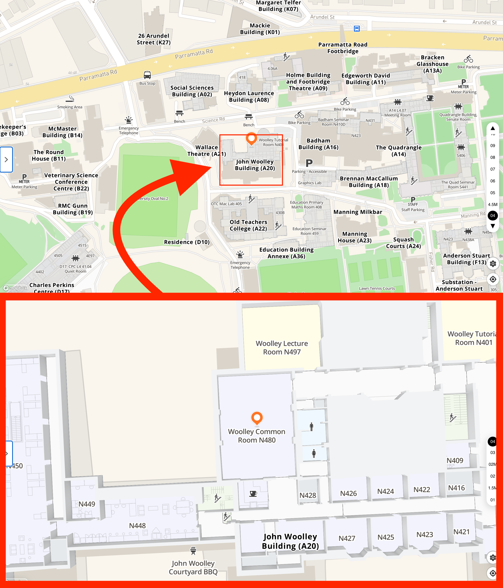

# Comparative Internet Research: Longitudinal Insights and Methods

## When
Tuesday, 25 June 2024 
From 1 pm to 3:30 pm

## Where
[Woolley Common Room N480](https://maps.sydney.edu.au/?room=A20.04.N480), The University of Sydney

## Program

### 1-2 pm **First session**

[Prof. Dr. Martin Emmer (Weizenbaum Institut)](https://www.polsoz.fu-berlin.de/en/kommwiss/arbeitsstellen/mediennutzung/mitarbeiterinnen/martin_emmer/index.html)
- [Weizenbaum Institute](https://www.weizenbaum-institut.de/en/) and its style of research
- Research paper: "Has the Internet turned bad? A longitudinal analysis of two decades of digital participation"

### 2-2:15 pm  **Coffee break**

### 2:15-3:30 pm **Second session**

[Prof. Ariadne Vromen (Australian National Univeristy)](https://crawford.anu.edu.au/people/academic/ariadne-vromen) 
- Research methods: Qualitative Internet research
  
[Dr. Francesco Bailo (University of Sydney)](https://www.sydney.edu.au/arts/about/our-people/academic-staff/francesco-bailo.html?apcode=ACADPROFILE300808)
- Research methods: Wikibase for mixed methods Internet research
  
[Roland Toth](https://www.weizenbaum-institut.de/en/portrait/p/roland-toth/#page=1&sort=date)
- Research paper: "Everyday Smartphone Use in 2023: Combining Survey, Mobile Experience Sampling, Logging, and Data Donation"
  
The session will conclude with a discussion on comparative Internet research and its methods. 

## Contact
Francesco Bailo: Francesco.Bailo@sydney.edu.au, +61 (0)2 8627 6895
